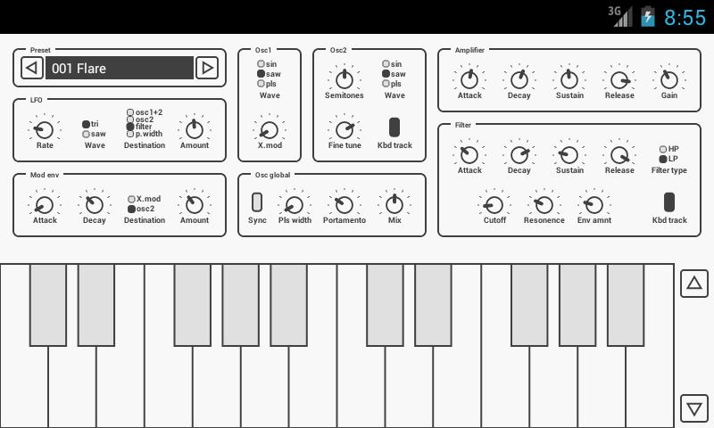

## Dream Factory: Team Synth

You need to make a synthesizer that you can play collaboratively with other musicians over the internet. A synthesizer is something that can generate different kinds of sound waves and manipulate them. They look like this:

You need to make one that allows you to play with other musicians in real-time, record your performances, and publish them to the public.

You need to find 2 ways to enable this functionality. For each way, identify:

1. What programming languages and frameworks you intend to use
1. What, if any, libraries you intend to use
1. What, if any, hardware you need
1. How all of these pieces will work together

Use `solution-1.md` and `solution-2.md` to fill out your answers. Please include diagrams where appropriate.
